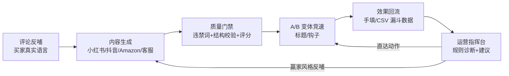

# ShopGenie（商店精灵）

**面向中小电商商家的 AI 运营操作系统**——不止生成内容，而是把「生成 → 投放 → 数据回流 → 诊断 → 迭代」连成一个数据驱动的运营闭环。

> 🔗 **在线体验**：[liujufu.com](https://liujufu.com) · 一条命令灌入演示数据，3 分钟走完核心流程（见下方快速开始）

## 它解决什么问题

中小商家请不起内容团队和运营。市面上的 AI 工具停在"帮你写文案"，写完之后呢？发出去效果如何、下一篇怎么改、哪个商品值得投入——没有工具回答。ShopGenie 的差异化是**闭环**：



## 核心能力

| 模块 | 说明 |
|------|------|
| **每日运营指挥台** | 打开首页直接看到今天最值得做的 3-5 件事：按资产聚合诊断、平台差异化 CTR 基准、近 7 天 vs 前 7 天趋势告警、按曝光影响排序；建议可忽略/完成，有新数据自动复活；每条建议带预填上下文直达对应工具 |
| **平台 API 只读同步** | 后端预配置只读连接器，显式同步真实效果数据；全量校验、幂等写入，不执行平台写操作 |
| **评论反哺** | 粘贴买家评价 → 提炼高频卖点/痛点/踩雷词/原声金句 → 自动注入该商品所有后续生成，把"模型臆想卖点"换成"买家真实在乎的点" |
| **多平台生成** | 小红书种草笔记、抖音短视频脚本、Amazon Listing、客服话术；各平台独立结构契约 + SSE 流式输出 + 一键全平台批量 |
| **A/B 实验** | 一键生成多策略标题/钩子变体 → 真实投放回填数据 → 达到最小样本量才判定赢家 → 赢家风格反哺后续生成 |
| **质量保障** | 违禁词检测、平台结构强校验（校验失败不出成品，最多自动矫正一次）、质量评分、词级版本 diff |
| **营销日历** | 节点提醒 + 按品类的应景选题，一键带选题进入创作 |

## 设计决策（为什么这么做）

1. **平台强契约**：生成结果必须通过确定性结构校验才能展示和入库，失败自动矫正一次、仍失败则明确报错——宁可不出稿，不出错误稿。
2. **商品上下文锁定**：会话产生真实消息后商品绑定即锁定，切商品必须新建会话——从机制上杜绝"A 商品历史混入 B 商品事实"的串货。
3. **不编造的数据底座**：所有诊断只基于用户录入的真实效果数据；评论洞察必须携带商品归属才会注入；演示数据走独立种子脚本、明确标注，不混入真实回流。
4. **确定性规则优先**：指挥台诊断、CSV 校验、A/B 判胜全部是可解释的确定性规则，LLM 只用在生成环节——该稳定的地方不引入概率。

## 工程质量

- **164 个自动化测试**（后端 pytest 124 + 前端 vitest 40），覆盖平台契约、商品上下文、指挥台规则、A/B 判胜、CSV 原子导入与平台 API 连接器
- **多 agent 协作开发流程**：由多个 AI coding agent 并行实现，人工负责 PRD、架构决策与代码评审（评审记录见 git history——包括拦下数据污染接口与安全缺陷的真实案例）
- [PRD.md](PRD.md)（产品定义 + 演进路线）与 [PROGRESS.md](PROGRESS.md)（如实标注未完成项的进度日志）全程维护

## 技术栈

**后端** Python 3.11 / FastAPI / SQLite / SSE　**前端** Next.js 16 / React 19 / TypeScript / SWR / CSS　**LLM** DeepSeek（OpenAI 兼容）

## 快速开始

```bash
# 后端
cd backend
python -m venv .venv && .venv/bin/pip install -r requirements.txt
cp .env.example .env                          # 填入 DeepSeek API Key
.venv/bin/python scripts/seed_demo.py         # 可选：灌入演示数据（已有数据加 --force）
.venv/bin/uvicorn app.main:app --port 8000 --reload

# 前端
cd frontend && npm install && npm run dev     # http://localhost:3000/shopgenie

# 测试
cd backend && .venv/bin/python -m pytest tests/ -v
cd frontend && npm test
```

## 项目结构

```
backend/app/
├── main.py                  # FastAPI 路由
├── operations.py            # 运营指挥台：确定性诊断规则 + 建议生命周期
├── review_mining.py         # 评论反哺：买家评价 → 结构化洞察
├── ab_testing.py            # A/B 变体生成 + 最小样本量判胜
├── performance_import.py    # CSV 预览校验 + 原子批量导入
├── platform_connectors.py   # 只读平台 API 效果数据同步
├── marketing.py             # 营销节点日历
├── platform_validator.py    # 平台结构强校验
├── postprocess.py           # 违禁词 + 平台规则检查
├── workspace.py             # 商品/内容/版本/效果/实验存储
├── deepseek.py / stream.py  # LLM 客户端 + SSE 流式
└── studio.py / vision.py    # 暂缓的商品图实验代码，不在当前产品入口

frontend/src/
├── app/page.tsx             # 单页应用入口 + 深链路由
├── components/              # 指挥台/工作台/聊天/批量
├── hooks/useChat.ts         # 会话状态 + 流式消费 + 持久化
└── lib/                     # API 客户端 / SWR 数据层
```

## License

Private — 求职作品展示用途。
